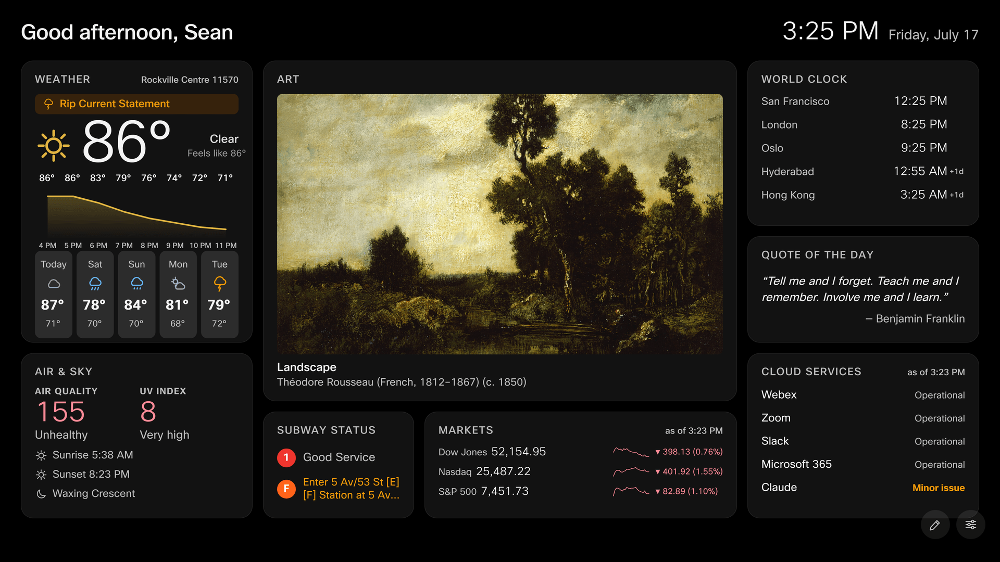
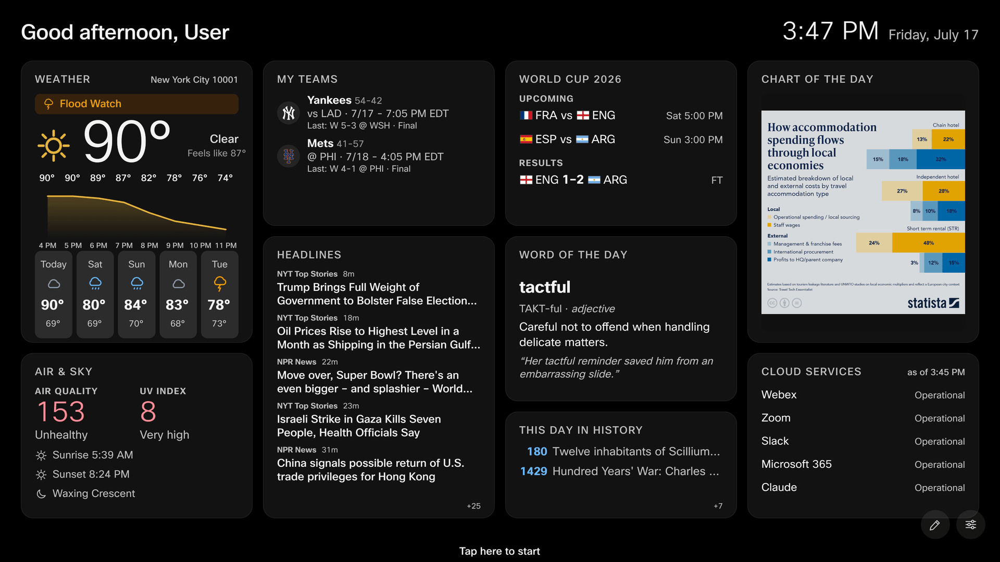
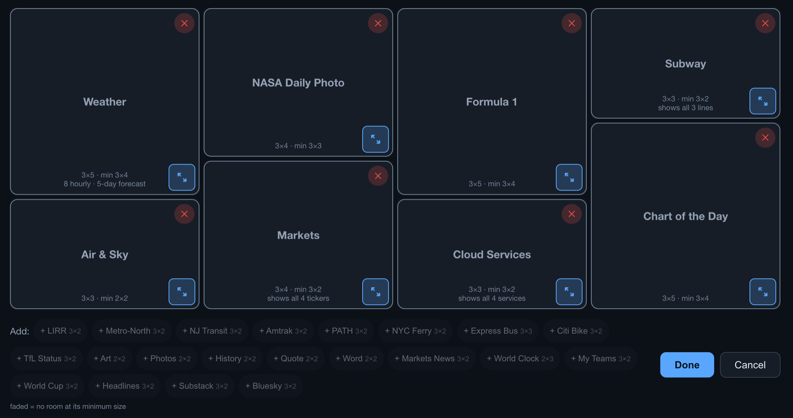

<p align="center">
  <picture>
    <source media="(prefers-color-scheme: dark)" srcset="assets/room-and-board-lockup-dark.png">
    
  </picture>
</p>

A lightweight, personal signage dashboard — **Room & Board** (`roomboard.app`) —
for touch enabled Cisco RoomOS endpoints such as the Board Pro and Desk Pro: worldwide weather, transit boards (NYC Subway status, LIRR,
Metro-North, NJ Transit, PATH, NYC Ferry, Express Bus, Citi Bike; London TfL
status), market tickers, sports scores, headlines, cloud-service status,
public-domain art, photo slideshows, and daily extras (NASA's photo of the
day, Statista's chart of the day, and more). Hosted entirely on the
public internet, personalized per device **without authentication**, with
preferences that survive reboots, RoomOS upgrades.



<table>
  <tr>
    <td width="50%"></td>
    <td width="50%"></td>
  </tr>
</table>


*Two example layouts; the on-board edit mode (every card drags and resizes on
the touchscreen, with live capacity hints); and the full-screen art screensaver
with its ambient info band.*

## How it works

```
┌─ Static site (Cloudflare Pages) ─────────────────────────────┐
│ /        dashboard (widgets, ambient art, touch settings)    │
│ /setup   companion page → 6-char setup code                  │
│ /photo-setup  album/folder walkthrough → photos-only code    │
└──────────────────────────────────────────────────────────────┘
┌─ Cloudflare Worker (worker/) ────────────────────────────────┐
│ /code            setup-code exchange (KV, 1h TTL, single-use)│
│ /njt/*           NJ Transit proxy (their ToS requires one)   │
│ /markets         tickers via Yahoo, cached 5 min             │
│ /alerts/*        MTA service-alert digests (subway/lirr/mnr) │
│ /sports/team     ESPN digest + live scoreboard score join    │
│ /news/*, /posts/substack     RSS + posts whitelist proxies   │
│ /bus/stops, /path/realtime, /ferry/departures,               │
│ /citibike/status, /tfl/status      more transit digests      │
│ /icloud/album, /gdrive/album       photo-album digests       │
│ /services/status, /apod, /chart    status pages · NASA photo │
│                                    · Statista chart of day   │
│ /fleet           anonymous usage ping → Analytics Engine     │
└──────────────────────────────────────────────────────────────┘
┌─ Each Board Pro ─────────────────────────────────────────────┐
│ SignageManager macro + Signage_Storage vault (inactive macro)│
│ localStorage (signage profile) = primary store               │
│ URL fragment: #cfg=<config>&auth=<bridge creds>              │
└──────────────────────────────────────────────────────────────┘
```

- Weather/AQI (Open-Meteo), NWS alerts, LIRR + Metro-North GTFS-RT (decoded by
  a ~120-line protobuf reader, oracle-tested against `gtfs-realtime-bindings`),
  art (Met/AIC), and history (Wikimedia) are fetched **directly from the
  browser** — all verified CORS-open and keyless. Everything else (subway alert
  digests, PATH, ferry, bus, Citi Bike, TfL, sports, news, Substack, photo
  albums, cloud-service status, NASA photo, the Statista chart) rides the
  Worker's Cache-API layer.
- Config is deflate+base64url JSON (~200 chars). localStorage is primary;
  every save is mirrored to the macro vault over the device's own WebSocket
  xAPI, and the macro re-seeds the page through the URL fragment after a wipe.

## Widgets

Everything is opt-in. Toggle widgets on/off under **Settings → Widgets** —
grouped by category (Commute, Weather & Air, Markets & Sports, News & Social,
Ambient, Daily Extras) — then tap the **✎ pencil** to drag, resize, and arrange
them on the 12×8 grid — each
widget has a minimum size and shows more content as you make its card bigger
(the edit screen tells you how many rows fit). The clock/greeting across the top
is always on. Every widget degrades gracefully: a dead feed dims the card and
stamps "as of …" rather than going blank, and long text taps to full screen.

Configure each widget in its own **Settings** section (on the board by touch, or
from your phone at `/setup` — whose widget picker and config sections share the
same categories). Configurable list widgets (markets, sports, world
clock, headlines, Substack, Bluesky) ship with sensible starter entries you can
remove like any other.

### Weather & sky

- **Weather** — current conditions, an hourly temperature trend line, and a
  multi-day forecast strip, worldwide (Open-Meteo). US locations also get a
  National Weather Service alert banner when one is active. *Configure:*
  Settings → Weather (search any city worldwide or a 5-digit US ZIP; drives
  Air & Sky too). Picking a location defaults the unit by region (US → °F,
  elsewhere → °C); the °F/°C toggle overrides.
- **Air & Sky** — labeled AQI and UV-index dials (color-coded by band), plus
  sunrise, sunset, and the moon phase. *Configure:* none — uses your weather location.

### NYC-area transit

- **Subway Status** — Good Service or the current alert for each line you pick.
  *Configure:* Settings → Subway (tap line bullets; shuttle "S" and express
  variants are matched automatically).
- **LIRR** / **Metro-North** — departure boards with live minutes, track, and
  service alerts. LIRR picks its terminal — Penn Station (default), Grand
  Central, or both, with each row tagged by terminal when both. Metro-North is
  Grand Central. *Configure:* their Settings sections; pick the station your
  trains must stop at (named in the card corner — required, the card prompts
  until one is chosen), and toggle the alert banner.
- **NJ Transit** — scheduled departures from one NJT rail station (default New
  York Penn) — time, destination, and line. RailData's schedule feed carries no
  live track or per-train status, so live delays and disruptions show as a
  service-alert banner instead. Amtrak trains that share the station are filtered
  out (they have their own card). *Configure:* Settings → NJ Transit (pick the
  origin station; toggle alerts).
- **Amtrak** — departures from Moynihan Train Hall / New York Penn (NYP), with
  route, train number, status, and platform when assigned. Shows trains
  stopping at your destination (named in the card corner) with the arrival
  time there — a destination is required; the card prompts until one is
  chosen. *Configure:* Settings → Amtrak (pick a destination; toggle alerts).
- **PATH** — next trains at one station as colored line dots + minutes; choose
  one direction or both. *Configure:* Settings → PATH.
- **NYC Ferry** — next departures from one landing, with route name and color.
  *Configure:* Settings → NYC Ferry.
- **Express Bus** — arrivals for up to two route + stop picks (choose an
  express route QM/BM/SIM/X, then direction, then stop), in minutes or
  distance. *Configure:* Settings → Express Bus (needs a free BusTime key on
  the Worker; see Data sources — the picker works without it).
- **Citi Bike** — live bikes (e-bikes called out) and open docks at up to six
  stations; defaults to the stations nearest the office. *Configure:* Settings →
  Citi Bike (search a station by its cross-streets). Keyless.
- **TfL Status** — London line status (Tube + Elizabeth line + DLR + Overground):
  a coloured dot + name + "Good Service" / the current disruption per line you
  pick; tap a disrupted line for the full reason. *Configure:* Settings → TfL
  Status (toggle lines by mode). Keyless.

### Markets, sports & news

- **Markets** — Dow / Nasdaq / S&P by default, plus any tickers you add
  (indexes start with `^`), each with a sparkline and change. *Configure:*
  Settings → Markets (add/remove tickers; unknown symbols are rejected).
- **My Teams** — one glanceable row per followed team: live score, final, or
  next game, with the last result. *Configure:* Settings → My Teams (up to 6,
  across MLB/NFL/NBA/NHL/MLS/EPL).
- **World Cup 2026** — live / upcoming / recent matches during the tournament.
  *Configure:* none.
- **Formula 1** — next Grand Prix, last race's podium, and the driver and
  constructor standings. Team-colour dots and driver country flags; the layout
  adapts to the card size (standings side-by-side when wide, stacked when
  narrow). *Configure:* none.
- **Live Video** — a live HLS stream (your own https `.m3u8` link) playing
  muted on the card via a vendored hls.js (no native HLS in RoomOS's
  Chromium). No stream is bundled; add yours from the phone setup page.
  *Configure:* /setup → Live Video.
- **Golf (PGA)** — live PGA Tour leaderboard for the current tournament
  (majors included), with each player's total and today's round. Off weeks
  show the next event and start date. *Configure:* none.
- **Tennis** — the current ATP and WTA tournaments: live singles matches
  first, then today's upcoming and the freshest finals. *Configure:* none.
- **Markets News** — newest finance stories merged across the sources you
  enable (MarketWatch, WSJ Markets, FT Markets, CNBC, NYT Business, Yahoo
  Finance on by default; Seeking Alpha opt-in). *Configure:* Settings →
  Markets News.
- **Headlines** — newest stories merged across the news sources you enable
  (NYT sections, NPR, BBC, Gothamist). *Configure:* Settings → Headlines.
- **Substack** — latest posts from up to 6 followed publications. *Configure:*
  Settings → Substack (type the publication name before `.substack.com`).
- **Bluesky** — latest posts from up to 6 followed accounts. *Configure:*
  Settings → Bluesky (type the handle; a one-tap `.bsky.social` key helps).

### Time & ambient

- **World Clock** — up to 10 cities in order of their current time, with a
  next-day marker. *Configure:* Settings → World Clock (offices or any zone).
- **Art** — a rotating public-domain artwork (Met / Art Institute of Chicago /
  Cleveland); tap it for full screen, and swipe there to browse. Also powers the
  ambient screensaver. *Configure:* Settings → Art (rotation interval; optional
  collections). Whether the board shows the dashboard or ambient art is set
  under **Settings → Display**: *Always dashboard*, *Always art*, or
  **Scheduled** — the dashboard shows during your own daily time windows (up to
  four, 15-minute steps) and art shows the rest of the time.
- **iCloud Photos** / **GDrive Photos** — rotating photo slideshows from an
  iCloud **Shared Album** and/or a **public Google Drive folder**. They're two
  independent widgets — add either or both, each with its own album, rotation
  interval, and screensaver option (on the dashboard both cards are titled
  simply "Photos"); tap for full screen, swipe to browse. Either one — never
  both — can replace Art as the ambient screensaver. *Configure:* from your
  phone at **`/photo-setup`** (each widget's Settings pane shows a QR straight
  to it): the page walks through creating the shared album/folder, checks your
  link against the live feed, and mints a short board code — one code covers
  either source or both, and entering it changes only the photo slots it
  carries. Drive needs a free API key on the Worker; see Data sources.
  ⚠️ The album/folder is shared with a public link — anyone with the link can
  view the photos, so add only office-appropriate ones.
- **NASA Daily Photo** — NASA's Astronomy Picture of the Day: the image + its
  title, tap for full screen with the explanation. Changes once a day; video
  days are skipped automatically. *Configure:* none (uses a free NASA key on the
  Worker; see Data sources).

### Daily extras

- **Cloud Services** — subway-board rows for the cloud services your office
  depends on (Webex, Zoom, Slack, Ubiquiti, Cloudflare, GitHub, Microsoft 365,
  Google Workspace, AWS, Claude, OpenAI) from their public status pages; tap a
  degraded service for the full incident detail. Starts with Webex, Slack, and
  Microsoft 365. *Configure:* Settings → Cloud Services (toggle services
  on/off). No API keys — all sources are public.
- **This Day in History** — notable events on today's date (Wikimedia).
- **Quote of the Day** / **Word of the Day** — a curated daily quote / word
  with definition and example.
- **Chart of the Day** — Statista's latest daily infographic; tap for full
  screen with the description. Statista explicitly permits embedding their
  infographics with attribution (CC BY-ND; their branding is part of the
  image). *Configure:* none.

## Local development

```bash
npm install
npm test                # site+logic suites, then worker suite
npx http-server site -c-1 -p 8087   # -c-1 matters: Chrome heuristic-caches ES modules otherwise
open 'http://localhost:8087/?demo=1'           # full dashboard, canned data
open 'http://localhost:8087/?demo=1&mode=ambient'
npx wrangler dev --config worker/wrangler.toml # worker on :8787
```

`?demo=1` renders every widget from fixtures with zero network.

## Deployment

### 1. Static site → Cloudflare Pages

Point a Pages project at this repo:

- **Build command:** `node tools/stamp-version.js` (stamps `version.json` with
  the commit SHA — boards poll it hourly and self-reload after each deploy)
- **Build output directory:** `site`
- **Custom domain:** add your subdomain (e.g. `signage.yourdomain.com`) under
  the project's Custom domains — DNS + TLS are automatic when the zone is in
  the same Cloudflare account.

Two values are specific to this deployment and **must be changed in a fork**:

- **`site/js/env.js` (`WORKER_URL`)** — point it at *your* Worker before the
  first deploy, e.g.

  ```js
  export const WORKER_URL = 'https://signage-api.yourdomain.com';
  ```

  (The shipped file routes to this project's own `api.roomboard.app` plus a
  backup domain; a fork that keeps it would send every board's requests — and
  the anonymous usage pings below — to the original operator's Worker.)
- **`package.json` `deploy:site`** — the script hardcodes
  `--project-name signage`; replace it with your Pages project's name.

### 2. Worker

```bash
cd worker
npx wrangler kv namespace create CODES     # put the id into wrangler.toml
npx wrangler secret put NJT_USER           # from developer.njtransit.com
npx wrangler secret put NJT_PASS
npx wrangler deploy
```

Without NJT credentials everything else still works; the NJT widget shows
"unavailable" (worker returns `njt_not_configured`).

**Usage metrics (optional).** Boards send an anonymous hourly heartbeat to
`POST /fleet`. Exactly what is collected, for transparency:

**Sent by the board** (in the request body):
- a **random device id** generated on the board (a UUID in `localStorage`; not tied to any account, regenerated if storage is cleared),
- the **widget ids** on its layout (e.g. `weather,subway,markets`),
- the **display mode** (`scheduled` / `dashboard` / `ambient`),
- the running **site version**,
- the **IANA timezone** (e.g. `America/New_York`).

**Derived by the worker** from the request (the board sends neither):
- the **country** — an ISO code (`US`, `GB`, …) from Cloudflare's edge geolocation. Country-level only; **no IP address is stored** and nothing finer than country,
- the **Cisco device model** — parsed from the RoomOS WebEngine User-Agent (`Cisco Board Pro`, `Cisco Desk Pro`, …); non-RoomOS traffic records as `other`.

**Never collected:** the greeting name, chosen stations/locations/coordinates,
album links, IP addresses, or any widget content. The device id is random and
carries no identity.

Each ping is written to a
[Workers Analytics Engine](https://developers.cloudflare.com/analytics/analytics-engine/)
dataset (`roomboard_usage`, binding in `wrangler.toml`) queryable via its SQL
API for active-device counts, widget adoption, and the fields above. Board
owners can switch the ping off under **Settings → Diagnostics**; self-hosters
who want no metrics at all can delete the `analytics_engine_datasets` block —
the route then accepts and discards pings so boards never see an error.

> **⚠ Self-hosters:** the beacon defaults **on** and posts to `WORKER_URL`.
> If a fork ships with the original `site/js/env.js`, its boards report their
> widget adoption to *this* project's Worker, not yours — change `WORKER_URL`
> (step 1 above) and deploy your own Worker so the pings land in your own
> dataset (or nowhere, if you removed the binding). (The
route and module are named `fleet`, not `beacon`/`analytics`, on purpose:
ad-blocker filter lists match those keywords, and a blocked module import
would take the whole dashboard down in a desktop preview.)

> **Verify on first live run:** the RailData response mapping in
> `worker/src/njt.js` follows community clients; confirm the field names
> against a real response once credentials exist (all shape knowledge is
> isolated in that file).

### 3. Boards

```bash
cp deploy/devices.example.csv deploy/devices.csv   # one host per line
DEVICE_USER=admin DEVICE_PASS=... SITE_URL=https://your-site.pages.dev \
  node deploy/provision.js --dry-run                # inspect
DEVICE_USER=admin DEVICE_PASS=... SITE_URL=https://your-site.pages.dev \
  node deploy/provision.js
```

Per board this enables the web engine, interactive signage, the device-cert
WebSocket path, and installs + activates the SignageManager macro. Pilot on
one board first. Recommended extras per Cisco guidance: configure
`Time OfficeHours` so signage runs ≤ 12 h/day.

### 4. Non-touch devices (Room series driving a TV)

Non-touch devices can't enter setup codes, so they take the configuration in
the signage URL itself. Get the URL from a working config: on a template
board, gear → **Setup code** → **Show QR of current config**, open it on your
phone, then tap **Get signage URL (non-touch boards)** — or build a config on
`/setup` from scratch and tap the same button. Then set, in the device's web
interface (or Control Hub → device configurations):

```
xConfiguration WebEngine Mode: On
xConfiguration Standby Signage Mode: On
xConfiguration Standby Signage InteractionMode: NonInteractive
xConfiguration Standby Signage Url: <the generated URL>
```

**Do not install the SignageManager macro on these devices** — its startup
composes the signage URL from its own (empty) vault and would overwrite the
one you pasted. Here the URL itself is the persistence: it survives reboots,
upgrades, and web-storage wipes by definition. To change the config later,
regenerate the URL (it carries a fresh timestamp, so it always wins over the
device's cached copy) and paste it again; the board picks it up at its next
reload (hourly version check, nightly 4 AM, or a power cycle). The exported
URL deliberately contains only `#cfg=` — never the `auth` credentials a
macro-managed board's URL carries.

### Arranging the dashboard

Tap the ✎ pencil button: the 12×8 grid appears — drag widgets to move them
(colliders are pushed aside live), drag the corner handle to resize (snaps to
cells, per-widget minimums), ✕ removes, and the bottom tray re-adds anything
removed. Invalid drops flash red and snap back. Done saves (localStorage +
macro vault); Cancel discards. Layouts live in config v3; v1/v2 configs
migrate automatically on first load.

Widget notes: **LIRR** (Penn Station, Grand Central, or both) / **Metro-North**
(Grand Central) are departure boards with a required stops-at-station filter
(named in the card corner; the card prompts until one is picked); **Subway** is
a line-status board — Good Service or the current alert per chosen line;
**PATH** / **NYC Ferry** show one chosen station/landing (named in the card
corner); **Weather** defaults to ZIP 10001; **World Clock** holds up to 10
cities (defaults: New York, San Francisco, London, Hyderabad, Hong Kong).

### User flow

1. Board shows a welcome screen → user visits `/setup` on their phone,
   picks widgets/stations, taps **Get my setup code**.
2. On the board: gear → **Setup code** → type the 6 characters → Save.
3. Later edits: directly on the touch screen, or gear → Setup code →
   **Show QR** to pull the current config back to a phone.

### Disaster drill (verifies the vault)

```
xCommand WebEngine DeleteStorage Type: Signage
```

then put the board in standby and wake it: the macro re-seeds the config via
the URL fragment and the dashboard returns configured.

## Data sources & care

| Source | Access | Notes |
|---|---|---|
| Open-Meteo (weather, AQI) | direct, keyless | free tier is "non-commercial" — buy their inexpensive key if strictness matters |
| api.weather.gov (alerts) | direct, keyless | enhancement-only |
| MTA LIRR + MNR GTFS-RT | direct, keyless | GET only (HEAD returns 403); 60 s jittered polling |
| MTA alert feeds (camsys) | Worker digest | raw subway feed ~800 KB → ~2 KB digest shared fleet-wide |
| MTA BusTime SIRI | Worker + free key | `wrangler secret put MTA_BUS_KEY`; widget reports unconfigured until set |
| Google Drive API | Worker + free key | `wrangler secret put GDRIVE_KEY` (free Cloud project, Drive API enabled, key restricted to it); the GDrive Photos widget reports unconfigured until set. Lists images sitting directly in the folder — subfolders aren't traversed |
| Service status pages | Worker proxy, no keys | Statuspage instances (Zoom/Ubiquiti/Cloudflare/GitHub/Claude) + OpenAI (incident.io compat) + Slack/Microsoft/Google/Webex/AWS public JSON; failures report "Unknown", never fake green |
| NASA APOD | Worker + free key | `wrangler secret put NASA_KEY` (free key from api.nasa.gov); falls back to `DEMO_KEY` when unset — viable because the 1h fleet-shared cache stays under DEMO_KEY's daily cap, but the real key is preferred |
| Statista Chart of the Day | Worker, keyless | No feed exists — the worker scrapes the listing page (session-cookie SSO bounce walked manually, see `worker/src/chart.js`), cached 1 h; boards hotlink the infographic from `cdn.statcdn.com` (probe-verified: no referer/cookie checks). Scrape breaks if Statista reworks the page markup |
| ESPN site API (sports, World Cup) | Worker + browser | live scores join the league scoreboard Worker-side (team feed nulls them mid-game) |
| Amtraker (Amtrak) | Worker, keyless | unofficial community API (no official public Amtrak feed); worker filters the all-trains feed to NYP departures, caches 60 s fleet-wide, empty/stale-tolerant; destination filter is client-side over each train's downstream stops (`worker/src/amtrak.js`) |
| Your HLS stream (Live Video) | Browser, user-supplied | https .m3u8 the user provides; played via vendored hls.js light (Apache-2.0) over MSE, quality capped to card size; nothing bundled or defaulted (`site/js/widgets/iptv.js`, `site/js/vendor/hls.light.min.js`) |
| ESPN scoreboard (Golf, Tennis) | Browser, keyless | CORS-open golf/pga + tennis atp/wta scoreboards fetched directly by the board; config-less, 5-min refresh (`site/js/widgets/golf.js`, `tennis.js`) |
| Jolpica-F1 (Formula 1) | Worker, keyless | Ergast successor, not CORS-open; worker fans out next race + last result + driver/constructor standings, merges + caches 1 h, serves partial on upstream failure (`worker/src/f1.js`) |
| NYT / Gothamist / NPR / BBC (headlines) | direct + Worker proxy | feed whitelist in `worker/src/news.js` |
| Substack publications (latest posts) | Worker, keyless | `/posts/substack?pub=<slug>` digest; no CORS upstream |
| Bluesky public AppView (latest posts) | direct, keyless | CORS-open; also validates handles when adding accounts |
| TrainTime (LIRR tracks) | direct, unofficial | feature-detected; drops silently if the host vanishes |
| NJ Transit RailData | Worker + credentials | their ToS **requires** serving from a non-NJT server; auth is your developer-portal login (no separate key) exchanged for a session token. **`getToken` is capped at just 10/day** (the data endpoints allow 40,000/day), so the worker caches the token in the **Cache API** — it survives isolate eviction and is shared across boards/isolates, so `getToken` fires ~once per token lifetime, not per cold start — and re-authenticates only on a 401. `getStationSchedule` is a whole-day timetable per station (array of station objects; departures nested in `ITEMS`) with no live track/status — delays arrive via `getStationMSG` as alerts; NJT vs Amtrak is split by numeric-vs-letter train id (`worker/src/njt.js`) |
| Yahoo Finance (markets) | Worker, unofficial | browser UA + 5 min cache; widget hides if it breaks |
| Met + AIC + Cleveland (art) | build-time manifest | CC0 works; `node tools/build-art-manifest.js` to refresh |
| Wikimedia (history) | direct, keyless | |
| PANYNJ RidePATH (PATH) | Worker, keyless | no CORS upstream; 30 s cached digest, projected epochs |
| NYC Ferry GTFS-RT | Worker, keyless | protobuf decoded Worker-side; trip/route names from bundled `data/ferry.json` |
| Citi Bike GBFS | Worker, keyless | live `station_status` proxied + cached 60 s; station names from bundled `data/citibike-stations.json` (rebuild via `tools/build-citibike-data.js`) |
| TfL Unified API | Worker, keyless | `Line/Mode/.../Status` proxied + cached 120 s; line names/colours in `site/js/tfl-lines.js`; optional `TFL_KEY` only raises rate limits |
| Bundled words.json (word of the day) | none | curated 366+ list, zero network — shares `dailyPick` with quotes |
| iCloud Shared Streams (photos) | Worker, keyless (unofficial) | webstream + webasseturls endpoints; CORS-locked Worker-side; digest cached ~30 min; signed image URLs fetched by the board via `` |

**Resize-fit audit (standing policy):** widgets must fit their text at every
supported size. After renderer/CSS changes, open `?demo=1` in Chrome and, for
each `.card`, place it at its demo size, its `MIN_SIZE`, and a 3-tall variant
(set `gridColumn`/`gridRow` spans + `data-w`/`data-h`), then assert
`card__body.scrollHeight <= clientHeight + 2`. Fix overflows with measured
`data-w`/`data-h` compact CSS variants (no container queries on gen1 Chromium).
Ship only at zero overflow.

Rebuild station data after MTA changes: `node tools/build-stations.js`.
Rebuild ferry landings/trips after NYC Ferry schedule changes:
`node tools/build-ferry-data.js` (a stale trips map only degrades ferry
destination labels — the widget falls back to each trip's last stop name).
Refresh test fixtures: `node tools/record-fixtures.js`.

## Security

Room & Board is a **read-only** signage app that renders **public** data feeds.
It has no user accounts, no passwords, and holds no personal data beyond an
optional first-name greeting — a deliberately small attack surface, and the code
is written to keep it that way.

**Client (board + phone)**
- **Output encoding everywhere.** Every third-party feed string (headlines,
  transit alerts, status-page incidents, captions) is HTML-escaped at render.
  Configuration that arrives in the URL fragment is sanitized in
  `normalizeConfig` — labels stripped of markup, ids constrained to their
  charset — before it can reach the DOM.
- **Content-Security-Policy.** Both pages ship a strict CSP (`script-src 'self'`,
  `object-src 'none'`, `base-uri 'none'`, …) as defense-in-depth: an injected
  inline handler or foreign script is blocked even if encoding were bypassed.
- **No dynamic code.** No `eval`, `new Function`, `document.write`, or
  `postMessage` handlers; scripts and modules load only from the same origin.

**Worker (API proxy)**
- **No SSRF.** Caller input is regex- or allow-list-validated before it reaches
  the path or query of a fixed upstream host — it can't redirect the Worker to
  an arbitrary host.
- **Secrets stay server-side.** Optional API keys (MTA BusTime, Google Drive,
  NASA) live as Worker secrets, are URL-encoded into upstream requests, and are
  never returned to the client or written to logs.
- **Bounded & resilient.** Responses cache in the Cache API (never KV); routes
  validate and cap their parameters; upstream failures degrade to stale-or-empty
  rather than a wrong answer.

**Macro-managed boards (Cisco RoomOS)**
- The page↔device bridge uses a **low-privilege account whose passphrase rotates
  on every boot**; the passphrase is never placed on a JavaScript global, and the
  device address is format-validated before use.
- Setup codes are short-lived (1 hour), best-effort single-use, and carry only
  widget preferences — no secrets.

**Review & testing.** The codebase has been through a multi-pass security and
correctness review (SSRF, XSS/injection, cache poisoning, secret handling, and
long-running-device reliability); findings were fixed and are covered by the
test suite (`npm test` — 400+ cases across site and Worker).

**Reporting a vulnerability.** Please open a private security advisory via
GitHub's *Report a vulnerability* rather than a public issue.

## Repo map

```
site/       static app (no framework, no bundler; ES modules)
worker/     Cloudflare Worker (code exchange + cached upstream digests)
macro/      SignageManager RoomOS macro (vault + bridge + signage URL)
deploy/     provision.js fleet setup over jsxapi
tools/      data builders (stations, art manifest, fixtures)
test/       vitest suites (+ worker pool project in worker/vitest.config.js)
```
